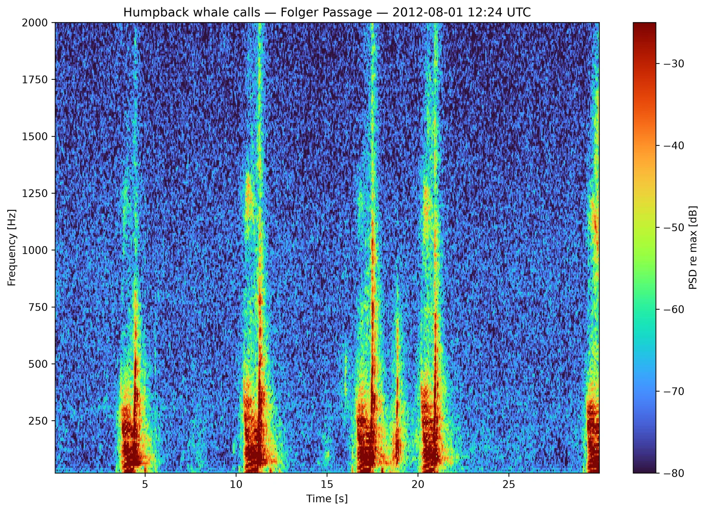
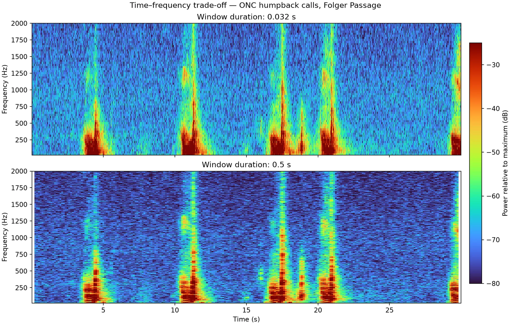

# Generate Local Spectrograms

Local spectrograms are computed from downloaded FLAC/WAV audio. You control the
FFT window, overlap, frequency range, colour scale, backend, and saved formats.

If you have not downloaded audio yet, start with
**[Download Audio](audio_downloads.md)** or the complete
**[audio-to-spectrogram walkthrough](quickstart.md)**.

## Process an audio directory

```python
from pathlib import Path

from onc_hydrophone_data.audio import SpectrogramGenerator

audio_dir = Path("data/DEVICE/RUN/audio")
output_dir = audio_dir.parent / "custom_spectrograms"

generator = SpectrogramGenerator(
    win_dur=0.5,
    overlap=0.75,
    freq_lims=(20, 10_000),
    crop_freq_lims=True,
    clim=(-60, 0),
    log_freq=False,
)

results = generator.process_directory(
    audio_dir,
    output_dir,
    save_plot=True,   # PNG
    save_mat=True,    # MATLAB arrays + metadata
    save_npy=False,
    max_workers=4,
)
```

One successful result contains `png_file`, `mat_file`, audio metadata, and
processing settings. Batch results omit the large in-memory arrays by default
to keep memory use bounded.

{: width="100%" loading="lazy" }

The sample contains synthetic tones, frequency sweeps, short events, and noise
so common spectrogram shapes are easy to recognize. Real ONC audio will differ.

## Choose useful parameters

| Setting | Start with | Effect |
| --- | --- | --- |
| `win_dur` | `0.5` s | Longer windows improve frequency detail; shorter windows improve timing detail |
| `overlap` | `0.5`–`0.75` | Higher overlap creates more time columns and costs more compute |
| `freq_lims` | Your band of interest | Controls the plotted frequency range |
| `crop_freq_lims` | `True` for focused work | Also removes out-of-band rows from MAT/NumPy output, saving disk and memory |
| `clim` | `(-60, 0)` | Sets contrast in relative dB plots |
| `log_freq` | `False` initially | Use `True` when several frequency decades must fit on one axis |
| `backend` | `"auto"` | Uses an available optimized backend and falls back to SciPy when needed |

### Window length trade-off

{: width="100%" loading="lazy" }

The short window keeps brief events narrow in time but produces broader
frequency bands. The long window sharpens steady tones and sweeps in frequency
but spreads short events across time.

!!! note "Illustrative figures"
    Both figures are generated from deterministic synthetic audio by
    `scripts/generate_docs_figures.py`. They are examples of package output,
    not calibrated ONC measurements.

## Process one file

```python
result = generator.process_single_file(
    audio_dir / "example.flac",
    output_dir,
    save_plot=True,
    save_mat=True,
    save_npy=True,
)

print(result["png_file"])
print(result["mat_file"])
print(result["npy_file"])
```

Use the single-file form while tuning parameters, then process the whole
directory after the output looks right.

## Command-line workflow

From a cloned repository checkout:

```bash
python scripts/generate_spectrograms.py \
    --input-dir data/DEVICE/RUN/audio \
    --output-dir data/DEVICE/RUN/custom_spectrograms \
    --win-dur 0.5 \
    --overlap 0.75 \
    --freq-min 20 \
    --freq-max 10000 \
    --crop-freq-lims \
    --max-workers 4
```

Run `python scripts/generate_spectrograms.py --help` for every option.

## Generate event clips from JSON

For many labeled events, one workflow can download the needed audio context,
clip each event, and generate local spectrograms:

```python
results = dl.create_custom_spectrograms_from_json(
    "custom_requests.json",
    save_mat=True,
    save_png=True,
)
```

```json
{
  "defaults": {
    "deviceCode": "ICLISTENHF6324",
    "pad_seconds": 10
  },
  "generator_defaults": {
    "win_dur": 0.5,
    "overlap": 0.75,
    "freq_lims": [20, 10000],
    "crop_freq_lims": true
  },
  "requests": [
    {
      "timestamp": "2024-04-01T12:30:00Z",
      "label": "example event",
      "generator_options": {
        "log_freq": false
      }
    }
  ]
}
```

The workflow requests adjacent source files when padding crosses a five-minute
boundary and trims the generated result back to the target interval.

## Understand the saved values

- `P` is the uncalibrated power spectrogram.
- `PdB_norm` is power in dB relative to the maximum value in that file.
- `F` contains frequency-bin centres in hertz.
- `T` contains time-bin centres in seconds.
- Metadata records the source audio and FFT/generator settings.

!!! important
    Local outputs are not automatically calibrated sound-pressure levels. If
    you need ONC calibration or standardized server products, read
    **[Choose ONC Server Spectrograms](onc_spectrogram_options.md)**.
