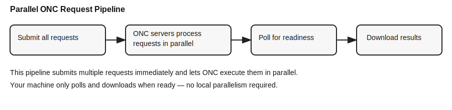

# ONC Hydrophone Data

Download hydrophone audio from Ocean Networks Canada (ONC), then turn it into
spectrograms with parameters you control.

!!! tip "New to ONC hydrophones?"
    Follow the three **Start Here** pages in order. They take you from an ONC
    account to your first locally generated spectrogram.

## The beginner path

1. **[Install and configure](setup.md)** — install the package, save your ONC
   token safely, and choose a data directory.
2. **[Find a hydrophone](inventory.md)** — identify a device code and a date
   range when that instrument was deployed and recording.
3. **[Download audio and make a spectrogram](quickstart.md)** — run one complete,
   copy-pasteable Python example and inspect the files it creates.

{: width="100%" loading="lazy" }

*Generated locally by this package from a real ONC hydrophone recording:
ICLISTENHF1205 at Folger Passage, 2012-08-01 12:24 UTC. Audio source and credit:
[Ocean Networks Canada Multimedia Manager](https://ibase.oceannetworks.ca/view-item?i=9860).*

## Audio first, server products second

Most users should download **FLAC/WAV audio** and create spectrograms locally.
That path preserves the source audio and lets you change window length,
frequency range, overlap, colour limits, and output format without requesting
the data again.

ONC also offers server-generated MAT, PNG, and PDF spectral products. Those are
useful when you need calibrated ONC products, compact long-term summaries, or a
quick visual scan. See **[Choose ONC Server Spectrograms](onc_spectrogram_options.md)**
when that is your goal.

## Choose the guide for your task

| I want to… | Start with |
| --- | --- |
| Download a short audio range | [Download Audio](audio_downloads.md) |
| Generate PNG/MAT spectrograms from audio | [Generate Local Spectrograms](custom_spectrograms.md) |
| Check whether a device has data for my dates | [Find a Hydrophone](inventory.md) |
| Sample many windows or download events from JSON/CSV | [Advanced & Batch Downloads](downloads.md) |
| Understand ONC's one-minute, plot, or full-resolution products | [Choose ONC Server Spectrograms](onc_spectrogram_options.md) |
| Fix a token, date-range, output-path, or backend problem | [Troubleshooting](troubleshooting.md) |

## How ONC requests are handled

For workflows that request server-generated products, the package submits
multiple jobs up front, then polls and downloads results as ONC finishes them.

{: width="100%" loading="lazy" }

If you prefer notebooks, the repository also includes
`notebooks/ONC_Data_Download_Tutorial.ipynb`.
