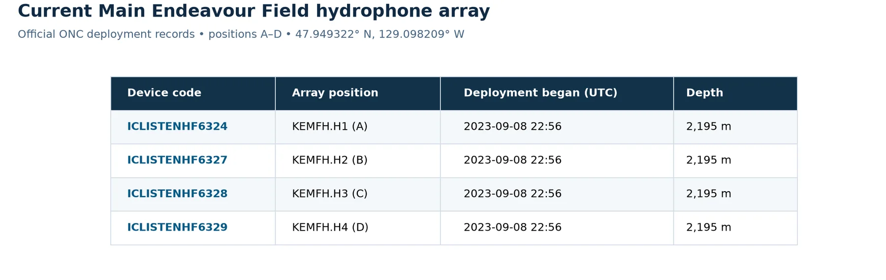
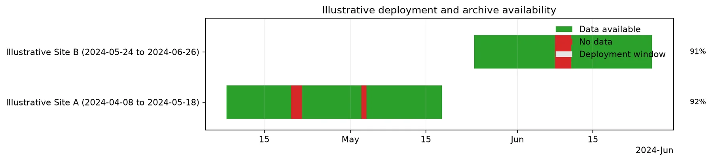
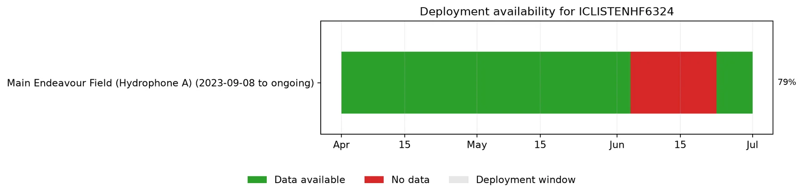
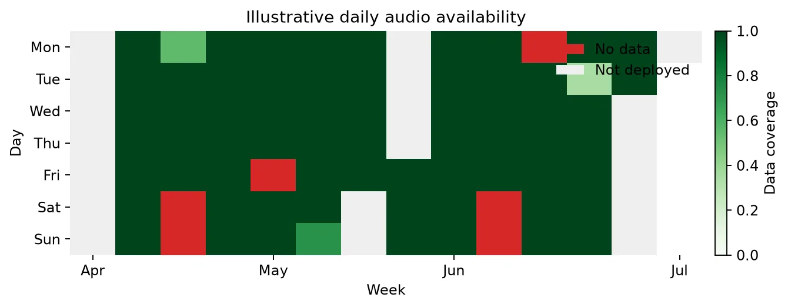

# 2. Find a Hydrophone and Valid Dates

A **device code** identifies an instrument, while a **deployment** tells you
where and when that instrument was installed. Always confirm both before
downloading: a valid device code can still return no files for dates outside a
deployment or during an archive gap.

## List current and historical deployments

```python
from onc_hydrophone_data.data.deployment_checker import (
    HydrophoneDeploymentChecker,
)
from onc_hydrophone_data.onc.common import load_config

onc_token, _ = load_config()
checker = HydrophoneDeploymentChecker(onc_token)
inventory = checker.collect_hydrophone_inventory()

# Instruments that appear to be deployed now.
checker.show_hydrophone_inventory_table(inventory, view="current")

# Historical deployments, including completed ones.
checker.show_hydrophone_inventory_table(
    inventory,
    view="history",
    max_rows=20,
)
```

For example, these are real records for the four-device hydrophone array at
Main Endeavour Field:

{: width="100%" loading="lazy" }

*Source: [ONC Hydrophone Location Codes & Data Types](https://wiki.oceannetworks.ca/spaces/O2KB/pages/72548584/ONC+Hydrophone+Location+Codes+Data+Types),
accessed 2026-07-14. An empty ONC end date means the deployment was ongoing in
that source snapshot.*

Focus on these columns:

| Column | Why it matters |
| --- | --- |
| `device_code` | The value passed to download methods |
| `location_name` | Where the hydrophone was deployed |
| `begin_date` / `end_date` | The time interval you can sensibly query |
| `position_name` | The element within a multi-hydrophone array, when present |

Once you find a candidate, show only that instrument's deployment history:

```python
checker.show_device_deployments(
    device_codes=["ICLISTENHF6324"],
    inventory=inventory,
)
```

These real ONC records show older single-hydrophone deployments followed by the
four-position Main Endeavour Field array that includes `ICLISTENHF6324`.

{: width="100%" loading="lazy" }

The [official ONC inventory](https://wiki.oceannetworks.ca/spaces/O2KB/pages/72548584/ONC+Hydrophone+Location+Codes+Data+Types)
listed no end date for the four array deployments when accessed on 2026-07-14,
meaning they were ongoing in that source snapshot.

## Confirm archive availability

A deployment window means the instrument was installed; it does not guarantee
that every hour has an archived audio file. Query a modest date range and plot
daily coverage:

```python
availability = checker.get_device_availability(
    "ICLISTENHF6324",
    start_date="2024-04-01",
    end_date="2024-07-01",
    timezone_str="UTC",
    bin_size="day",
)
```

!!! note
    Availability queries inspect ONC archive listings. Start with weeks or a
    few months rather than the instrument's entire history.

### Timeline view

```python
from onc_hydrophone_data.utils import plot_deployment_availability_timeline

timeline_fig, _ = plot_deployment_availability_timeline(
    availability,
    show=False,
)
timeline_fig.savefig(
    "availability_timeline.png",
    dpi=170,
    bbox_inches="tight",
)
```

{: width="100%" loading="lazy" }

The availability result distinguishes archived data, gaps during a deployment,
and dates when the device was not deployed. Coverage is the duration for which
merged archived audio intervals overlap each daily bin, divided by the bin's
total duration.

### Calendar view

```python
from onc_hydrophone_data.utils import plot_availability_calendar

calendar_fig, _ = plot_availability_calendar(
    availability,
    show=False,
)
calendar_fig.savefig(
    "availability_calendar.png",
    dpi=170,
    bbox_inches="tight",
)
```

{: width="100%" loading="lazy" }

Each calendar value is the fraction of that day covered by archived audio time
intervals. A zero value within a deployment is an archive gap; dates outside a
deployment are recorded separately rather than treated as missing data.

!!! info "Real archive result"
    Both plots above were generated on 2026-07-14 by running the documented
    query for `ICLISTENHF6324` from 2024-04-01 through 2024-07-01. ONC returned
    91 daily bins: 72 with archived data and 19 without data, covering
    2024-06-04 through 2024-06-22. Historical results can change if ONC
    reprocesses its archive, so rerun the commands when current status matters.

## Carry your choice into the download

Write down:

1. the `device_code`;
2. a UTC start time inside a green interval;
3. a UTC end time a few minutes later for your first test.

Continue to **[3. Download Audio and Make a Spectrogram](quickstart.md)** with
those values.
